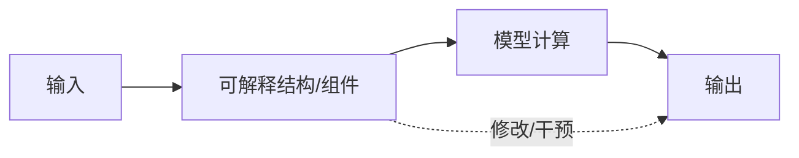
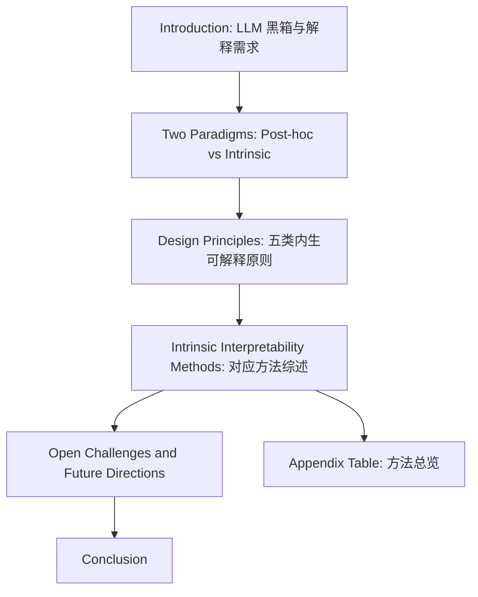
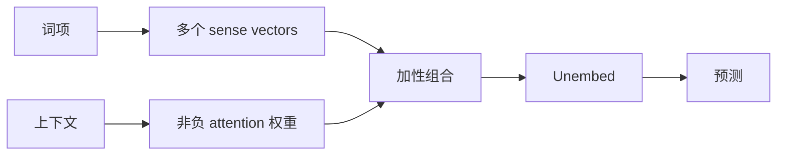

> [!note] 阅读边界
> 本报告**仅基于用户提供的 PDF**：[[820-Daily/260521_跨符号/Towards Intrinsic Interpretability of Large Language Models A Survey of Design Principles and Architectures.pdf]]。未使用外部网页、论文检索或额外资料。页码引用均来自该 PDF 的页面内容。

## 1. 论文定位与一句话总结

这是一篇关于 **LLM 内生可解释性（Intrinsic Interpretability）** 的综述论文。论文的核心主张是：当前 LLM 可解释性研究长期偏重“训练后再解释”的 post-hoc 方法，但这类方法往往存在解释与模型真实计算之间的**忠实性鸿沟（fidelity gap）**；因此，一个更根本的方向是把透明性直接设计进模型结构、训练目标和计算路径中，使解释成为模型计算本身的一部分。

论文将内生可解释性方法归纳为五类设计原则：

1. **功能透明性（Functional Transparency）**
2. **概念对齐（Concept Alignment）**
3. **表征可分解性（Representational Decomposability）**
4. **显式模块化（Explicit Modularization）**
5. **潜在稀疏性诱导（Latent Sparsity Induction）**

论文不是提出一个新模型，而是提出一个组织该领域的分类框架，并系统梳理不同架构如何通过结构设计获得可解释性。

---

## 2. 研究背景：为什么研究这个内容？

### 2.1 LLM 的能力增长带来黑箱风险

论文开篇指出，大语言模型已经在大量 NLP 任务中取得强性能，但其内部机制复杂且不透明，使其成为“黑箱”。这种不透明性在医疗、法律等高风险场景中会造成信任、安全与部署风险（p.1）。

LLM 的问题并不只是“用户看不懂输出理由”，而是更深层的：

- 模型内部的决策链条不可见；
- 解释可能与真实计算不一致；
- 模型可能给出看似合理但并不忠实的解释；
- 在安全关键场景中，无法判断模型是否依赖了错误特征、捷径或不可接受的推理路径。

因此，LLM 可解释性的目标不应只停留在“生成一段解释文本”，而应追问：**解释是否真实对应模型的计算过程？**

### 2.2 现有 post-hoc 方法的核心痛点：解释与真实计算脱节

论文将主流解释方法分为两大范式：

**图 1：post-hoc 分析与 intrinsic design 的对比**：左侧 post-hoc 方法通过外部分析工具解释已训练模型；右侧 intrinsic 方法将可解释结构放入模型计算路径中。

post-hoc 方法的典型路线包括：

- 行为层面的特征归因，如 LIME、SHAP；
- 内部表征分析，如 probing classifier、LogitLens；
- 机制解释工具，如 sparse autoencoder；
- 因果干预方法，如直接干预内部组件再观察输出变化。

论文指出这些方法的共同问题是：它们依赖**外部近似工具**，而不是模型的原生计算过程（p.2）。例如：

| 方法类型 | 主要问题 |
|---|---|
| LIME / SHAP 等归因方法 | 依赖局部替代模型，解释可能只是近似 |
| probing | 发现隐藏状态中含有某概念，不代表模型真正使用该概念 |
| SAE 等机制工具 | 通过重构近似 forward-pass 激活，存在重构误差 |
| 因果干预 | 局部忠实性更强，但结果细粒度、难以整合成高层解释 |

因此，post-hoc 解释虽然灵活，但存在著名的 **fidelity gap**：解释路径不一定等于模型真实计算路径。

### 2.3 内生可解释性的基本动机

内生可解释性试图解决上述 fidelity gap。它不再把解释当作模型训练完成后的外部补丁，而是要求：

> 模型的内部计算结构本身就是可解释的，解释与计算不可分离。

论文进一步提出判断 intrinsic 方法的关键标准：**因果必要性（causal necessity）**。如果可解释组件，例如专家、概念、稀疏特征，位于模型的关键计算路径上，并且修改它会直接改变模型输出，那么该方法更接近内生可解释性（p.2）。

这意味着 intrinsic 方法追求的是 **structural fidelity（结构忠实性）**：模型行为与解释结构之间存在直接对应关系。

---

## 3. 当前研究痛点

论文认为，内生可解释性虽然正在快速发展，但仍存在几个核心痛点。

### 3.1 领域碎片化，缺少统一分类框架

相比 post-hoc 可解释性已有大量综述，内生可解释性研究散落在不同模型类别、架构设计和训练原则中（p.2）。例如 GAM、CBM、MoE、KAN、Backpack LM、稀疏 Transformer 等都与内生可解释性有关，但它们之间的共同原则并不清晰。

论文的出发点正是：需要一个统一框架来回答：

- 哪些结构设计真正把可解释性嵌入了模型？
- 不同方法的透明性来自哪里？
- 它们在性能、训练成本、表达能力、可扩展性上如何权衡？

### 3.2 可解释性与表达能力之间长期存在张力

传统 intrinsically interpretable 模型，如线性模型、广义加性模型（GAM），可解释性强但表达能力有限。复杂 NLP 任务需要高维、非线性、上下文依赖的建模能力，简单透明模型难以胜任（p.3）。

因此，核心挑战是：

> 如何在不牺牲 LLM 能力的前提下，让模型内部结构保持可读、可控、可干预？

### 3.3 可解释性评估尚不成熟

论文在开放挑战中指出，当前仍缺乏严格且被广泛接受的 intrinsic interpretability 定义与评估指标（p.8）。常见 proxy 指标如稀疏性、模块化、解耦性，并不保证人类真正能理解，也不保证模型确实依赖这些结构进行推理。

换言之：

- 稀疏 ≠ 语义清晰；
- 模块化 ≠ 模块含义稳定；
- 概念瓶颈 ≠ 概念足够完整；
- 可视化曲线 ≠ 解释忠实。

### 3.4 大规模扩展困难

许多内生可解释架构只在小到中等规模模型上验证（p.8）。扩展到十亿级参数 LLM 会遇到：

- 路由复杂度上升；
- 内存开销增加；
- 训练不稳定；
- 专家负载不均衡；
- 稀疏约束与优化目标冲突；
- 特殊结构在硬件上不高效。

---

## 4. 研究贡献：该论文解决了什么问题？优势是什么？

论文贡献可以概括为三点（p.2）：

### 4.1 明确区分 post-hoc explanation 与 intrinsic interpretability

论文不是简单地把所有解释方法放在一起，而是从设计哲学、忠实性、解释范围等角度区分两种范式：

| 维度 | Post-hoc explanation | Intrinsic interpretability |
|---|---|---|
| 时间 | 模型训练后解释 | 模型设计与训练时嵌入解释结构 |
| 解释来源 | 外部分析工具、替代模型、探针 | 模型内部原生结构或计算路径 |
| 忠实性风险 | 易出现 fidelity gap | 追求 structural fidelity |
| 优势 | 灵活，适用于已有模型 | 解释与计算绑定，更接近真实机制 |
| 局限 | 解释可能不忠实 | 可能损失表达能力、训练更复杂 |

该区分的价值在于：它把“解释模型”与“构造可解释模型”明确分开，避免把 post-hoc 的局部分析误认为模型本身透明。

### 4.2 提出五类内生可解释性设计原则

论文最重要的贡献是提出如下分类框架：

**图 2：内生可解释 LLM 架构的五类设计原则**：论文用这五类原则组织现有方法。

五类原则不是互斥集合，而是组织性原则。某些方法可以同时具备多种属性，但论文根据其最直接嵌入可解释性的机制进行归类。

### 4.3 系统梳理代表方法及其权衡

论文不仅列举方法，还从以下角度比较：

- 透明性来源；
- 关键机制；
- 训练成本；
- 推理成本；
- 相对黑箱基线的性能变化。

**表 1：论文附录中总结的内生可解释方法对比**：该表显示不同方法在解释来源、训练/推理成本和性能表现上的差异。

### 4.4 论文优势

这篇综述的优势在于：

1. **从设计原则而非工具名称分类**：更适合理解方法背后的共同逻辑。
2. **强调结构忠实性**：把解释是否在关键计算路径上作为核心标准。
3. **覆盖范围广**：从 GAM、CBM 到 MoE、Backpack、CoCoMix、稀疏 Transformer 等。
4. **明确讨论 trade-off**：不把内生可解释性神化，而是指出表达能力、训练效率、可扩展性等问题。
5. **适合连接 LLM 架构研究与机制解释研究**：把模型设计和解释目标统一起来。

---

## 5. 研究原理：该研究基于什么原理？为什么可以这么做？

### 5.1 基本原理：解释必须进入计算路径

论文对 intrinsic interpretability 的核心定义基于“可解释组件是否在关键计算路径上”。如果解释组件只是训练后观察到的相关因素，它可能不是模型真正使用的原因；但如果模型的输出必须经过这些组件，那么解释就更有机会具备结构忠实性。

因此，内生可解释性的基本逻辑是：

如果 B 的改变会直接影响 D，那么 B 不只是观察对象，而是模型因果计算链条的一部分。

### 5.2 为什么结构设计能够提升可解释性？

论文中不同方法虽然技术路径不同，但都遵循一个共同思想：通过架构或训练约束减少黑箱网络中的高维纠缠。

常见机制包括：

- **加性结构**：把整体输出分解为各特征贡献之和；
- **概念瓶颈**：让模型必须经过人类可理解概念；
- **正交/解耦子空间**：把不同因素放入不同表征通道；
- **专家模块与路由**：让不同输入走不同可追踪专家路径；
- **稀疏激活/稀疏权重**：减少所有特征混在一起的 superposition；
- **离散 codebook**：把连续隐藏状态压缩为离散、可检查的代码。

这些机制都在试图把“密集、纠缠、不可读”的神经计算变成“稀疏、分解、可定位、可干预”的计算。

### 5.3 五类原则之间的内在关系

五类设计原则可理解为从不同角度约束模型：

| 原则 | 约束对象 | 解释来自哪里 |
|---|---|---|
| 功能透明性 | 函数形式与数学结构 | 可视化函数、加性项、边函数、线性解释 |
| 概念对齐 | 隐变量语义 | 人类可理解概念或概念向量 |
| 表征可分解性 | 潜在空间几何 | 独立 sense vector、连续概念向量、可控子空间 |
| 显式模块化 | 计算路径 | 专家、路由、任务/语言/领域模块 |
| 潜在稀疏性诱导 | 权重或激活模式 | 稀疏电路、条件激活路径 |

---

## 6. 研究方法：该研究采用什么框架？整体结构是什么样的？

本文是综述型研究，采用的框架不是实验流程，而是**概念分类 + 代表方法梳理 + 权衡分析 + 未来挑战**。

### 6.1 论文整体结构

### 6.2 论文方法框架

论文的组织逻辑可以概括为：

1. 先指出 post-hoc 方法的忠实性限制；
2. 定义 intrinsic interpretability 的目标与判据；
3. 抽象出五种设计原则；
4. 将已有方法映射到五类原则；
5. 讨论每类方法的优势、代价和开放问题。

### 6.3 研究对象范围

论文关注的是面向 LLM 或可迁移至 LLM 的内生可解释架构，包括：

- 传统透明模型：GAM、GA2M、EBM；
- 神经加性模型：GAMI-Net、NODE-GAM；
- 自解释网络：SENN；
- 权重-输入对齐模型：B-cos Networks / B-cos LMs；
- KAN；
- 概念瓶颈模型：CBM、SCBM、Hybrid CBM、CB-LLM、CEM；
- 离散瓶颈：Codebook Features；
- 表征分解模型：Backpack LM、Char-BLM、CoCoMix；
- MoE 解释架构：MoE-X、MoV、MoLORA、MONET、MxD、Task-Based MoE、THOR-MoE、Apollo-MoE、RoMA、USMoE 等；
- 稀疏诱导：Weight-Sparse Transformer、GLU/SwiGLU。

---

## 7. 研究细节：五类方法的分步拆解

### 7.1 功能透明性（Functional Transparency）

#### 7.1.1 目标

功能透明性关注模型的函数形式是否可读。它希望模型的计算不仅结构上明确，而且数学语义清楚。也就是说，模型不应只是密集层的黑箱组合，而应让人能看到“哪里在计算”和“计算了什么”。

#### 7.1.2 GAM / GA2M / EBM

GAM 将预测函数写成多个单变量函数之和：

$$
F(x)=f_0+\sum_i f_i(x_i)
$$

每个 $f_i$ 对应一个输入特征的贡献，因此可以通过 shape function 直接检查某个特征如何影响输出（p.4）。

GA2M 进一步加入两两交互：

$$
F(x)=f_0+\sum_i f_i(x_i)+\sum_{i,j}f_{ij}(x_i,x_j)
$$

这增强了表达力，但也增加了计算与统计复杂度。EBM 使用 boosting 更高效地学习加性项和低阶交互项。

**解释来源**：特征贡献函数与交互图。  
**优点**：结构清晰、解释直接。  
**缺点**：表达能力有限，难以直接承担复杂 LLM 任务。

#### 7.1.3 Neural Additive Models

GAMI-Net、NODE-GAM、NODE-GA2M 用神经网络替代 GAM 中的平滑函数。每个特征或特征对由小型神经子网络建模，从而在保留可分解结构的同时增加非线性表达力（p.5）。

**核心思想**：不是放弃加性解释，而是让每个可解释项更强。  
**代价**：模型更复杂，训练与推理成本上升。

#### 7.1.4 SENN

SENN 将预测构造成“概念基 + 相关性分数”的组合。模型同时学习概念和每个概念的权重，并施加稳定性与可解释性约束，使每个概念对预测的贡献保持透明（p.5）。

**解释来源**：概念及其 relevance score。  
**关键点**：比线性模型灵活，但仍要求预测过程可分解。

#### 7.1.5 B-cos Networks / B-cos LMs

B-cos 方法修改预测变换，使权重与输入证据对齐。B-cos transform 鼓励模型权重方向与输入中真正支持预测的部分对齐，从而获得更忠实的线性解释（p.5）。

B-cos LMs 将该思想扩展到语言模型，通过 B-cos 风格变换与微调增强 NLP 解释忠实性。

#### 7.1.6 KAN

KAN 基于 Kolmogorov–Arnold 表示思想，将传统 MLP 中“边上的权重 + 节点上的固定激活”改为“边上的可学习一维函数”。每条边上的函数可以被可视化，因此具备较强功能透明性（p.5）。

**优势**：边函数可视化，某些情况下可剪枝并经符号回归得到简洁表达。  
**问题**：论文指出 KAN 在规模或输入维度增加时存在计算开销大、优化不稳定、性能不如标准 MLP 的风险。

---

### 7.2 概念对齐（Concept Alignment）

#### 7.2.1 目标

概念对齐关注潜变量是否对应人类可理解概念。它试图减少 polysemanticity，即单个神经单元或特征同时编码多个无关含义的问题（p.3）。

#### 7.2.2 标准 CBM：硬概念瓶颈

标准 Concept Bottleneck Model 将模型分成两段：

$$
g:X\rightarrow C,\quad f:C\rightarrow Y
$$

模型先从输入预测概念 $\hat c=g(x)$，再仅基于概念预测输出 $y=f(c)$（p.5）。

**解释来源**：中间概念分数。  
**优点**：推理路径被强制绑定到概念。  
**缺点**：如果概念集合不完整，任务相关信息会被瓶颈丢弃，造成准确率下降。

#### 7.2.3 SCBM

SCBM 放松了概念条件独立假设，学习概念的联合分布，而不是独立预测每个概念（p.5）。这使模型能表示概念之间的依赖。

#### 7.2.4 Hybrid CBM 与 CB-LLM

为缓解硬瓶颈造成的性能损失，Hybrid CBM 引入 side channel，让预测器同时访问显式概念 $c$ 与未受控 latent embedding $z$，即：

$$
y=f(c,z)
$$

CB-LLM 将该范式扩展到 LLM：在概念瓶颈旁加入无监督 latent pathway，并用对抗训练去除 latent channel 中与概念相关的信息（p.5-p.6）。

**优点**：性能更接近黑箱模型。  
**风险**：side channel 可能绕过概念瓶颈，降低结构忠实性。论文因此将这类方法视为以部分结构忠实性换取能力的 intrinsic design。

#### 7.2.5 CEM / IntCEM

CEM 不把概念压缩成单个标量，而是将每个概念表示为高维向量子空间（p.6）。这对 NLP 尤其重要，因为语言概念常有细微语义和多义性。

**解释来源**：概念向量。  
**优势**：比标量概念更有表达力。  
**约束**：下游预测器仍限制在线性概念交互中，以保持可归因性。

#### 7.2.6 Codebook Features

Codebook Features 使用向量量化，将连续隐藏状态近似为 learned codebook 中向量的稀疏组合（p.6）。

**意义**：不依赖人工概念标注，也能诱导出离散、可检查、常具有人类可解释性的特征。  
**限制**：论文指出目前主要在较小语言模型和有限任务上验证，大规模行为仍是开放问题。

---

### 7.3 表征可分解性（Representational Decomposability）

#### 7.3.1 目标

表征可分解性关注潜在空间几何结构，希望把不同变化因素拆到独立子空间或并行流中，使不同因素可以分别操作且互不干扰（p.3, p.6）。

#### 7.3.2 Backpack Language Models

Backpack LM 认为标准 Transformer 将上下文信息和词汇身份纠缠在同一个隐藏状态中，难以分离单个词义贡献。因此它给每个词汇项配备一组非上下文 sense vectors，并用 self-attention 产生非负权重来加性组合这些 sense vectors（p.6）。

其结构可理解为：

**解释来源**：每个词义向量与上下文权重。  
**优势**：可检查某个输出来自哪些 sense vector。  
**限制**：用固定 sense vector 的加性组合表示上下文意义，可能难以表达非线性交互。

#### 7.3.3 Character-level Chinese BLM

Char-BLM 将 Backpack 思想扩展到非字母语言，在中文字符级学习可解释 sense decomposition（p.6）。

#### 7.3.4 CoCoMix

CoCoMix 将 SAE 引入预训练过程，训练模型在 next-token prediction 之外预测连续概念表征，并将这些概念向量与隐藏状态交织使用（p.6）。

**关键变化**：概念不是 post-hoc 抽取，而是 forward pass 的结构组件。  
**优势**：支持对生成进行目标控制，同时维持输出连贯性。  
**代价**：需要额外训练结构，并依赖概念表征质量。

---

### 7.4 显式模块化（Explicit Modularization）

#### 7.4.1 目标

显式模块化将模型计算拆成独立功能模块，并使用路由机制选择输入应经过哪些模块。其典型代表是 MoE（Mixture-of-Experts）。

**图 4：内生可解释 MoE 的架构策略**：论文将可解释 MoE 分为专家内部稀疏、细粒度专家分解、语义对齐路由三类。

传统 MoE 主要用于扩展模型容量，专家与路由通常为负载均衡和效率服务，不一定语义透明。论文关注的是以解释性为中心重新设计 MoE。

#### 7.4.2 策略一：专家内部稀疏与简单化

MoE-X 用 ReLU 等硬阈值替代平滑激活，以在 hidden states 上强制稀疏，帮助解耦特征（p.7）。

MoV、MoLORA 将完整 MLP 专家替换为轻量向量或低秩 adapter。虽然它们主要提升效率，但线性或低秩专家比深层非线性 MLP 更容易分析。

**解释来源**：稀疏专家或低秩专家。  
**问题**：仍依赖路由和稀疏专家选择，训练时可能有负载不均衡。

#### 7.4.3 策略二：细粒度专家分解

MONET、MxD 等方法希望通过大规模细粒度专家获得更接近 monosemantic 的结构。它们用 product key composition、tensor factorization 等技术，从紧凑参数集中构造大量细粒度子层（p.7）。

**核心思想**：让专家数量和特征粒度更接近，从而把 MoE 层视为“专门线性变换的稀疏字典”。  
**代价**：专家空间扩大后，路由敏感性增强，训练更容易出现专家利用不足或不均衡。

#### 7.4.4 策略三：语义对齐路由

该策略让路由本身具备语义含义。论文区分两种路线（p.7）：

1. **显式结构对齐**：
   - Task-Based MoE 将任务上下文整合进 router；
   - THOR-MoE 使用层级任务引导和上下文响应路由；
   - Apollo-MoE 按语言族组织专家。
2. **隐式几何正则**：
   - RoMA 将 routing manifold 与任务 embedding 对齐；
   - USMoE 将专家选择重构为线性规划问题。

**解释来源**：任务、语言、领域或路由几何。  
**优势**：可追踪输入为何被送入某类专家。  
**风险**：路由策略增加优化复杂度，也可能影响全局表达能力。

---

### 7.5 潜在稀疏性诱导（Latent Sparsity Induction）

#### 7.5.1 目标

潜在稀疏性诱导不是预先指定模块，而是在标准 Transformer 内部诱导模块化和可解释结构自然出现（p.7-p.8）。

其基本假设是：密集网络不透明，部分原因在于所有通道高度活跃且相互纠缠；如果训练中鼓励选择性激活，就可能形成任务特定子电路。

#### 7.5.2 权重稀疏

Weight-Sparse Transformer 在训练过程中施加强稀疏约束，而不是训练后剪枝（p.8）。这样模型被迫更选择性地分配连接，减少 feature superposition，并产生更紧凑、可解释的计算电路。

**解释来源**：稀疏电路。  
**优势**：较强机制可解释性潜力。  
**问题**：当前硬件上不高效，且存在能力-可解释性 trade-off，扩展困难。

#### 7.5.3 GLU / SwiGLU 条件激活

GLU 在 Transformer feed-forward 层中引入门控：

$$
GLU(x)=(xW)\odot \sigma(xV)
$$

门控项按输入选择性抑制或放大特征，相当于将信息路由到不同子空间（p.8）。

**解释来源**：条件激活路径。  
**优势**：不需要显式定义专家，也能形成输入依赖的专门化。  
**限制**：GLU 不保证严格稀疏，解释性更多是诱导出来的，而非完全结构化保证。

---

## 8. 方法演化脉络

**图 3：内生可解释性的演化**：论文将该领域描述为从刚性、人类定义结构走向更灵活、数据驱动且可扩展的稀疏架构。

从图 3 和正文可以看出，内生可解释性的发展趋势是：

1. **早期**：GAM、GA2M 等结构透明但能力有限；
2. **中期**：CBM、CEM、Backpack 等引入概念和语义分解；
3. **近期**：MoE、Codebook、CoCoMix、稀疏训练等尝试将解释性与 LLM 规模结合；
4. **未来方向**：更灵活的数据驱动结构，同时保持可解释路径。

这说明研究重点正在从“人为定义可解释结构”转向“在大模型中诱导或组织可解释结构”。

---

## 9. 实验总览：论文进行了什么实验？达到了什么效果？

> [!important] 关键判断
> 这篇论文是综述论文，**没有提出新的模型，也没有进行统一的新实验或基准测试**。它的“实验/效果”主要体现为对已有研究结果的归纳比较，尤其是附录 Table 1 中对不同方法训练成本、推理成本和性能相对黑箱基线的总结。

### 9.1 论文中的证据形式

论文使用的证据主要包括：

- 对已有方法的机制描述；
- 对代表研究结论的引用；
- 对不同架构设计 trade-off 的归纳；
- 附录表格中跨方法对比。

### 9.2 效果概览

根据 Table 1，可以概括如下：

| 方法类别 | 通常效果 | 主要代价 |
|---|---|---|
| 功能透明性 | 解释结构清晰，部分方法性能接近基线 | 表达能力或训练成本受限，KAN 等推理/训练成本高 |
| 概念对齐 | 推理路径更语义化 | 硬瓶颈常导致性能下降，混合瓶颈牺牲部分忠实性 |
| 表征可分解性 | 可检查 sense / concept 贡献，支持控制 | 推理成本较高，性能可能下降或依赖概念质量 |
| 显式模块化 | 可追踪专家与路由，部分 MoE 性能可提升 | 路由复杂、专家负载不均衡、训练稳定性问题 |
| 潜在稀疏性诱导 | 稀疏电路更易解释，GLU/SwiGLU 可提升性能 | 权重稀疏训练成本高，能力-解释性 trade-off 明显 |

### 9.3 重要结论

论文的实验性归纳支持以下判断：

1. **解释性和性能不必然互斥**：一些 MoE、GLU/SwiGLU、B-cos、CEM 等方法可接近或提升黑箱基线。
2. **强结构约束通常带来性能风险**：标准 CBM、Codebook Features、Backpack、Weight-Sparse 等可能出现性能下降。
3. **更细粒度、更数据驱动的结构更适合 LLM 扩展**：例如 specialized MoE、稀疏训练和连续概念预训练。
4. **训练成本是重要瓶颈**：KAN、Bilinear MLP、Weight-Sparse 等训练成本较高。

---

## 10. 开放挑战与未来方向

论文提出五个核心开放方向（p.8-p.9）。

### 10.1 定义与评估 intrinsic interpretability

目前缺少严格指标。未来需要同时评估：

- 忠实性：解释是否对应真实计算；
- 可理解性：人类是否能理解；
- 完整性：解释是否覆盖关键机制；
- 可用性：解释是否能帮助调试、安全评估或控制模型。

### 10.2 平衡可解释性与表达能力

结构约束可能限制模型能力。未来需要明确：

- 何时稀疏性提升泛化？
- 何时模块化导致路由错误？
- 何时概念瓶颈丢失任务信息？
- 何种结构偏置适合 LLM 预训练？

### 10.3 扩展到大规模 LLM

需要证明 intrinsic interpretability 可以在十亿级模型中保持，而不只是小模型实验。关键问题包括路由复杂度、内存、通信、训练稳定性和硬件效率。

### 10.4 训练效率与优化稳定性

稀疏激活、模块路由、复杂函数参数化都会增加训练难度。未来需要更好的优化策略、正则化方案和硬件友好实现。

### 10.5 与 post-hoc 分析互补

论文并不主张完全抛弃 post-hoc。相反，post-hoc 工具可以用于验证和压力测试 intrinsically interpretable 模型；post-hoc 发现的概念、特征或电路也可反过来指导 intrinsic 架构设计（p.9）。

---

## 11. 对跨符号/中间表示研究的启发

结合该论文主题，可以得到以下启发（仅基于论文内容延伸）：

1. **“跨符号中间表示”可以被视为 concept alignment 与 representational decomposability 的交叉问题**：如果中间表示能对应稳定概念、sense 或 codebook 特征，它就可能成为 LLM 内部可解释结构。
2. **稀疏性是寻找中间表示的重要线索**：论文认为 dense superposition 是不透明的重要来源，因此稀疏电路或稀疏 code 可能更适合作为可解释中间表示。
3. **MoE 路由可作为符号-任务结构的显式接口**：任务、语言、领域、语义族等可被映射到专家或路由空间，从而形成可追踪计算路径。
4. **仅靠 post-hoc 抽取中间表示不足以保证忠实性**：若中间表示不在关键计算路径上，它可能只是相关信号，不一定是模型真正推理依据。
5. **理想目标是把中间表示变成模型必经结构**：例如概念瓶颈、连续概念预训练、离散 codebook 或可解释 MoE，而不是训练后再解释。

---

## 12. 论文局限

论文自身也指出了若干局限（p.9）：

- 领域发展很快，综述只能反映截至论文写作时的快照；
- 可能未覆盖未发表或同期 preprint；
- 为了保持广度与清晰度，论文强调统一原则，而不是对每个方法进行详尽技术推导；
- 缺少统一实验基准，因此跨方法对比主要是定性和引用式总结。

此外，从报告阅读角度，还可以注意：

- 该论文更适合作为研究地图，而不是算法实现指南；
- Table 1 的性能箭头是基于已有研究报告的汇总，并非作者统一复现实验；
- 内生可解释性的评价仍依赖未来社区共识。

---

## 13. 总结

这篇论文的核心价值在于：它把 LLM 可解释性研究从“解释黑箱模型”推进到“设计透明模型”的视角，并提出了五类设计原则来组织内生可解释性研究。

最重要的结论是：

> 真正可靠的 LLM 可解释性不应只依赖训练后的外部解释工具，而应尽可能让可解释结构进入模型原生计算路径，使解释与计算之间具备结构忠实性。

五类方法各有侧重：

- 功能透明性让函数形式可读；
- 概念对齐让中间变量具备人类语义；
- 表征可分解性让潜在空间可拆解、可控制；
- 显式模块化让计算路径可追踪；
- 潜在稀疏性诱导让模型内部自然形成更少纠缠的子电路。

但该领域仍面临定义、评估、规模化、训练效率和性能权衡等问题。对未来 LLM 研究而言，内生可解释性提供了一条重要路线：不仅要解释已有模型，更要构造本身更透明、更可控、更安全的模型。
