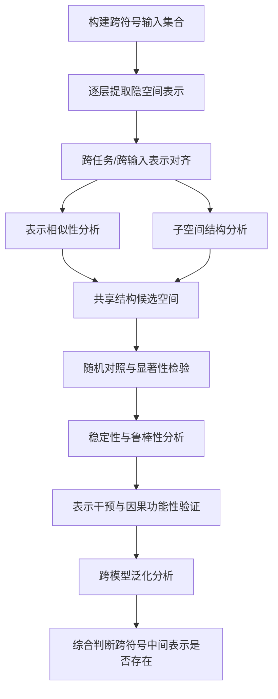

> [!note] 范围说明
> 本报告仅依据 [[天津市自然科学基金(大语言模型跨任务结构化中间表示机制探索与应用) V5.pdf]] 中“四、立项依据”至“八、拟解决的关键性问题及实现方法”的内容整理。报告聚焦“跨符号中间表示是否存在”，不展开讨论其在数学、生物制造、具身智能等其他任务中的应用价值。

## 1. 核心问题与结论先导

这份项目文本的中心非共识假设是：**大语言模型在大规模预训练过程中，可能已经在内部形成跨任务、跨符号系统的结构化中间表示**；不同任务之间的差异可能更多来自输入表达形式和接口形式，而非模型能力本身完全缺失。

围绕“是否存在”，文本提出的判断标准不是单纯观察某个可视化图像或某个任务效果，而是要求把问题转化为一个可检验的统计学问题：

1. 不同符号系统输入在模型隐空间中是否表现出**共享结构特征**；
2. 这种共享结构是否具有**统计显著性**，即显著偏离随机基线；
3. 这种结构是否在不同任务、不同输入扰动、不同模型架构和参数规模下保持**稳定性与可复现性**；
4. 这种结构是否具有**因果功能性**，即干预该结构会对不同符号系统任务产生一致影响。

因此，“跨符号中间表示是否存在”的研究不能停留在“看起来相似”，而应构建一套从表示提取、结构度量、子空间分析、统计检验、对照实验、干预验证到跨模型复现的完整验证链条。

## 2. 什么是跨符号系统

### 2.1 基本定义

根据文本中的任务定义，**跨符号系统**指大语言模型面对的多类异构输入系统。这些输入系统具有不同的语法规则、结构约束和语义组织方式，例如：

- 自然语言；
- 数学表达；
- 生物序列；
- 代码程序；
- 跨语言或低资源语言也可作为补充验证场景。

这些系统共同构成输入符号系统集合：

$$
\mathcal{X}=\{X_1,X_2,\ldots,X_n\}
$$

其中，不同 $X_i$ 分别对应不同类型的符号输入。

### 2.2 为什么称为“跨符号”

“跨符号”的重点不只是“跨任务”，而是**跨越不同表达系统**。自然语言、数学表达、生物序列、代码程序之间并非只是数据来源不同，它们在以下层面有本质差异：

| 维度 | 自然语言 | 数学表达 | 生物序列 | 代码程序 |
|---|---|---|---|---|
| 基本单位 | 词、字、token | 符号、变量、公式结构 | 氨基酸、核苷酸等序列单位 | 关键字、变量、语法节点 |
| 语法约束 | 较柔性 | 强形式化 | 序列与结构约束 | 强语法与执行约束 |
| 语义组织 | 上下文语义 | 逻辑与推理关系 | 结构-功能关系 | 程序语义与控制流 |
| 难点 | 歧义性 | 精确性 | 高维结构规律 | 可执行与可组合性 |

文本指出，现有研究多集中于自然语言任务，对数学表达、生物序列、代码程序等高度结构化且语法体系不同的符号系统关注不足。因此，所谓“跨符号系统”就是要把这些异构输入放入同一个模型隐空间分析框架中，研究它们是否在内部形成统一或部分统一的结构。

## 3. 什么是跨符号系统的中间表示

### 3.1 文本中的正式定义

文本将“大语言模型跨符号结构化中间表示”定义为：

> 大模型在处理不同符号系统输入时，在隐空间中形成的具有共享结构特征与可迁移能力的中间表示机制。

为了聚焦“是否存在”，可将其简化为：

**跨符号中间表示 = 不同符号系统输入在模型中间层隐空间中形成的、可被量化检测的共享结构。**

设大语言模型为 $f_\theta(\cdot)$，第 $l$ 层对输入符号系统 $X_i$ 产生的隐空间表示为：

$$
H_i^{(l)}=f_\theta^{(l)}(X_i)
$$

项目关注的是：是否存在某种共享结构，使得不同符号系统的隐空间表示在同一语义几何空间中呈现统计一致性与结构对齐性：

$$
\mathcal{D}(H_i^{(l)},H_j^{(l)})\le \epsilon, \quad X_i,X_j\in\mathcal{X}
$$

其中，$\mathcal{D}(\cdot)$ 是结构距离度量，例如子空间距离、谱结构差异或统计分布偏差；$\epsilon$ 是统计显著性阈值。

### 3.2 “中间表示”的关键特征

从文本可以归纳出跨符号中间表示至少包含四个判别特征：

1. **隐空间性**：它存在于模型中间层或隐状态中，而非直接存在于输入文本或输出答案中。
2. **共享结构性**：不同符号系统的表示不是完全割裂的，而是在某些几何结构、子空间或统计关系上相互对齐。
3. **层级演化性**：这种表示可能不是所有层都有，而是在模型不同层级中形成、增强、转移或消失，因此需要逐层分析。
4. **统计可验证性**：其存在不能只凭经验观察，必须通过显著性检验、稳定性分析和对照实验来证明。

### 3.3 与普通任务表示的区别

| 类型 | 普通任务驱动表示 | 跨符号中间表示 |
|---|---|---|
| 来源 | 针对单一任务训练或微调形成 | 可能由大规模预训练内生形成 |
| 分析对象 | 单一任务或单一符号系统 | 多任务、多符号系统 |
| 研究重点 | 任务性能 | 隐空间共享结构是否存在 |
| 验证方式 | 下游任务指标 | 表示相似性、子空间重叠、统计检验、干预实验 |
| 目标问题 | 能否完成某任务 | 不同符号系统是否共享内部结构 |

## 4. 为什么需要验证“存在性”

文本反复指出，现有研究在“中间表示是否存在”上存在三类不足：

1. **缺乏跨任务、跨符号系统的统一分析视角**  
   现有研究多基于单一任务、自然语言场景或局部推理任务，难以判断不同输入类型是否共享隐空间结构。

2. **缺乏严格统计检验**  
   许多研究依赖表征探测、可视化或相关性度量，但这些方法容易停留在经验观察层面，无法支撑“存在性”的可靠结论。

3. **缺乏稳定性与可复现性评估**  
   如果一个结构只在某个模型、某个任务、某个样本集合或某个随机种子下出现，就不足以证明它是稳健的跨符号机制。

因此，文本将核心问题表述为：**大语言模型内部是否存在跨符号结构化中间表示？** 其实现方法是：构建跨符号统一表示分析与统计检验框架。

## 5. 验证跨符号中间表示存在的方法总览

依据文本，可形成以下验证链条：



这些方法可分为七类：

1. 多层隐空间表示提取；
2. 跨符号表示对齐；
3. 表示相似性分析；
4. 子空间分析；
5. 随机对照与统计显著性检验；
6. 稳定性、鲁棒性与低资源场景验证；
7. 表示干预和跨模型泛化分析。

下面分别分析这些方法如何做、能够证明什么、可行性如何，以及实践上如何实现。

## 6. 方法一：多层隐空间表示提取

### 6.1 方法目的

多层隐空间表示提取是所有验证的起点。要判断中间表示是否存在，首先必须获得模型在处理不同符号系统输入时的中间层表示。

形式化表示为：

$$
H_i^{(l)}=f_\theta^{(l)}(X_i)
$$

其中：

- $X_i$：某一符号系统输入；
- $l$：模型层编号；
- $H_i^{(l)}$：模型第 $l$ 层产生的隐藏表示。

### 6.2 具体怎么做

实践上可以按以下步骤：

1. 选择模型：使用可访问中间层的开源大语言模型。
2. 构建输入集合：为自然语言、数学表达、生物序列、代码等分别准备输入样本。
3. 前向传播：不训练模型，只运行 forward pass。
4. 保存每一层 hidden states。
5. 对 token 级表示进行聚合，例如：
   - 取最后一个 token 表示；
   - 取特殊位置 token 表示；
   - 对所有 token 平均池化；
   - 对关键符号位置进行局部聚合。
6. 得到每个符号系统在每一层的表示矩阵。

### 6.3 可行性分析

文本认为该方法具有较强可行性，原因是：

- 主流开源模型生态成熟；
- 不同规模、不同架构模型通常支持中间层访问；
- 研究不必先训练模型，主要成本来自前向推理与表示存储；
- 团队具备大语言模型实验平台与算力资源。

### 6.4 局限与注意事项

- 隐空间维度高，直接比较容易受到噪声影响；
- 不同符号系统的 token 长度和结构差异较大，需要统一聚合策略；
- 不同模型 tokenizer 不同，不能简单比较原始 token 位置；
- 层数、位置、池化方式会影响结论，应进行敏感性分析。

## 7. 方法二：跨符号表示对齐

### 7.1 方法目的

不同符号系统的输入形式不同，即使模型内部存在共享结构，也不一定直接表现为同一坐标下的简单向量相等。因此需要进行跨任务、跨输入的表示对齐，分析它们是否进入同一语义几何空间。

### 7.2 具体怎么做

可以构建语义或功能等价的样本对/样本组，例如：

- 自然语言描述：“计算两个数之和”；
- 数学表达：$a+b$；
- 代码表达：`return a + b`；
- 生物序列场景中，则可以构建具有相似结构或功能标签的序列样本。

对齐思路包括：

1. **样本级对齐**：为不同符号系统构造语义相近或任务目标相近的输入对。
2. **层级对齐**：在同一模型的每一层比较这些输入的表示结构。
3. **结构级对齐**：不要求单个向量完全相同，而比较样本间关系矩阵、主子空间、谱结构等。
4. **跨模型对齐**：在不同模型中重复分析，观察结构是否一致。

### 7.3 可行性分析

可行性较高，但依赖样本设计质量。文本强调，需要在统一框架下实现可比性分析，因为不同任务差异显著。对于“存在性”研究，最关键的不是构建大规模任务数据，而是构建**可比的跨符号输入集合**。

### 7.4 实践建议

- 优先构造小而精的等价样本集，而不是大而噪的样本集；
- 每个符号系统至少包含多个语义类别，避免只验证单一概念；
- 使用相同 prompt 模板控制上下文差异；
- 将输入长度、难度和语义类别作为元数据记录；
- 对齐结论应按层、按符号系统对、按模型分别报告。

## 8. 方法三：表示相似性分析

### 8.1 方法目的

表示相似性分析用于量化不同符号系统隐层表示之间的几何结构是否相似。文本给出结构相似性的形式：

$$
S(H_i^{(l)},H_j^{(l)})=
\frac{|H_i^{(l)T}H_j^{(l)}|_F^2}
{|H_i^{(l)T}H_i^{(l)}|_F|H_j^{(l)T}H_j^{(l)}|_F}
$$

其中，$|\cdot|_F$ 表示 Frobenius 范数。较高的结构相似性意味着不同符号系统可能共享部分内部表示结构。

文本在第八部分也明确提到，可以使用子空间角度、CKA 相似性等表示相似性度量。

### 8.2 具体怎么做

1. 对每个符号系统 $X_i$，得到第 $l$ 层表示矩阵 $H_i^{(l)}$。
2. 对任意两个符号系统 $X_i,X_j$，计算相似性 $S(H_i^{(l)},H_j^{(l)})$。
3. 对所有层重复计算，得到层级相似性曲线。
4. 构建跨符号相似性矩阵，例如自然语言-数学、自然语言-代码、数学-代码等。
5. 与随机基线、扰动基线或标签打乱基线比较。

### 8.3 能证明什么

表示相似性分析可以证明：

- 不同符号系统是否在某些层出现更高结构相似性；
- 共享结构可能集中在哪些层；
- 哪些符号系统之间更容易形成对齐；
- 这种相似性是否高于随机水平。

但单独的相似性分析只能说明“相关”或“相似”，不能单独证明因果功能性。

### 8.4 可行性分析

该方法可行性高，因为：

- CKA、SVCCA、子空间角等方法已有成熟使用基础；
- 不需要训练模型，只需要提取表示；
- 适合多层、多模型批量计算；
- 文本明确将其作为核心技术路径。

### 8.5 风险与改进

风险：高相似性可能来自输入格式、长度、频率或模型共性处理流程，而非真正跨符号语义共享。

改进：

- 加入输入扰动；
- 加入语义不匹配负样本；
- 加入任务标签打乱；
- 控制 token 长度和模板；
- 与子空间分析和干预实验联合使用。

## 9. 方法四：子空间结构分析

### 9.1 方法目的

文本认为，不同符号系统的共享结构可能不是整个表示空间完全重合，而是存在于某些主表示子空间中。因此需要从子空间层面分析共享程度。

设不同符号系统在第 $l$ 层的主表示子空间分别为 $\mathcal{S}_i^{(l)}$ 与 $\mathcal{S}_j^{(l)}$，共享程度可表示为：

$$
O_{ij}^{(l)}=
\frac{\dim(\mathcal{S}_i^{(l)}\cap\mathcal{S}_j^{(l)})}
{\dim(\mathcal{S}_i^{(l)}\cup\mathcal{S}_j^{(l)})}
$$

通过分析子空间重叠程度，可以研究不同符号系统之间是否存在稳定共享结构区域，以及该结构在不同模型层级中的形成与演化规律。

### 9.2 具体怎么做

1. 对每个符号系统、每一层提取表示矩阵。
2. 对表示矩阵进行降维或分解，例如 PCA/SVD。
3. 选取解释方差达到某阈值的主成分作为主表示子空间。
4. 计算两个符号系统主子空间之间的：
   - 子空间夹角；
   - 投影矩阵距离；
   - 重叠维度；
   - 谱结构差异。
5. 比较不同层、不同符号系统、不同模型的子空间重叠模式。

### 9.3 能证明什么

子空间分析比整体相似性分析更适合回答：

- 共享结构是否只存在于部分维度；
- 共享表示的维度大致是多少；
- 共享结构在浅层、中层、深层如何变化；
- 不同符号系统是否共享同一个“结构区域”。

### 9.4 可行性分析

可行性较高。文本中明确提出使用子空间分析与子空间结构分解方法，并将其作为刻画共享结构候选空间的核心手段。其优势是适合高维隐空间分析，也能缓解原始向量直接比较的噪声问题。

### 9.5 实践注意事项

- 主子空间维度选择会影响结果，需要做维度敏感性分析；
- PCA/SVD 结果可能受样本分布影响，需要 bootstrap 或重复采样；
- 子空间重叠高并不必然代表语义共享，还需随机对照；
- 应报告每层的子空间重叠曲线，而不是只报告最高值。

## 10. 方法五：随机对照实验与统计显著性检验

### 10.1 方法目的

这是文本中验证“存在性”的核心步骤。没有统计检验，表示相似性和子空间重叠只能是经验观察。文本提出通过随机对照实验验证结构是否显著偏离随机基线。

随机条件下得到统计分布 $S_{rand}$，与观测值 $S_{obs}$ 比较：

$$
p=P(S_{rand}\ge S_{obs})
$$

当 $p<\alpha$ 时，可认为模型内部存在具有统计显著性的跨符号共享表示结构。

### 10.2 具体怎么做

文本列出三类随机对照操作：

1. **输入扰动**  
   对输入文本、公式、序列或代码进行扰动，破坏其结构或语义一致性。

2. **任务标签打乱**  
   打乱跨符号样本之间的对应关系，使原本语义/功能对齐的样本变成随机配对。

3. **表示层随机替换**  
   用随机层、随机样本或随机表示替换原始表示，形成无共享结构的基线。

实践上可重复 1000 次或更多次随机化，形成 $S_{rand}$ 的经验分布，然后计算观测统计量的 p 值。

### 10.3 能证明什么

该方法可以证明：

- 观察到的跨符号相似性是否显著高于随机水平；
- 子空间重叠是否不是偶然产生；
- 共享结构是否依赖真实语义/结构对应关系；
- 结论是否具有统计意义。

### 10.4 可行性分析

可行性高，且文本认为成熟统计分析方法能够为项目提供技术支撑。该方法不要求额外训练大模型，主要是实验设计与统计计算。

### 10.5 风险与改进

风险：

- 随机基线设计不合理，会导致虚假的显著性；
- 多层、多模型、多符号系统比较会带来多重检验问题；
- 样本量过小可能导致 p 值不稳定。

改进：

- 设置多种随机基线，而非单一基线；
- 使用多重比较校正；
- 报告效应量，而不仅报告 p 值；
- 使用 bootstrap 估计置信区间；
- 对每个符号系统对分别报告统计结果。

## 11. 方法六：稳定性、鲁棒性与低资源场景验证

### 11.1 方法目的

即使某个共享结构显著存在，也需要证明它不是偶然依赖某个样本、任务或数据分布。文本强调要通过稳定性分析和对照实验判断结构化中间表示在不同任务与输入条件下是否稳定存在。

### 11.2 具体怎么做

可以从四个层面做稳定性分析：

1. **样本稳定性**  
   对样本集进行 bootstrap 重采样，观察共享结构指标是否稳定。

2. **输入扰动稳定性**  
   对同一语义输入使用不同表达方式、不同 prompt 模板或轻微噪声扰动，观察结构是否保持。

3. **符号系统扩展稳定性**  
   加入低资源语言或少数民族语言等不同语法结构和数据分布的输入，测试共享表示是否在分布外条件下仍一致。

4. **层级稳定性**  
   观察共享结构是否在相邻层、某一层段或模型深层中连续出现，而不是单层偶然峰值。

### 11.3 能证明什么

稳定性分析可以证明：

- 共享结构是否具有可复现性；
- 共享结构是否对输入扰动鲁棒；
- 共享结构是否能够跨数据分布保留；
- 共享结构是否具有明确的层级形成规律。

### 11.4 可行性分析

文本认为可行性较强，因为：

- 神经表示分析和稳定性分析已有成熟方法；
- 多数据扰动条件可通过实验构造；
- 低资源语言可作为补充验证场景；
- 开源模型可支持多模型、多任务重复实验。

### 11.5 实践注意事项

- 低资源语言验证不应被误解为应用任务，而应作为“分布外鲁棒性测试”；
- 需要区分“跨语言共享”与“跨符号共享”，前者只是后者的一个较弱验证场景；
- 稳定性指标应与显著性检验结合，而不是单独报告平均相似度。

## 12. 方法七：表示干预与因果功能性验证

### 12.1 方法目的

文本指出，需要进一步引入表示干预方法，以验证共享结构是否具有因果功能性，而不仅是统计相关性。

干预形式为：

$$
\hat{H}^{(l)}=I\odot H^{(l)}
$$

并观察任务输出变化：

$$
\Delta y=f_\theta(H^{(l)})-f_\theta(\hat{H}^{(l)})
$$

如果干预能够在不同符号系统任务中产生一致性影响，则说明该结构不仅具有统计存在性，也具有明确的功能贡献。

### 12.2 具体怎么做

1. 根据前述相似性和子空间分析，定位候选共享结构区域。
2. 构造 mask $I$，对该区域进行屏蔽、削弱、噪声扰动或替换。
3. 对自然语言、数学表达、代码、低资源语言等不同符号系统输入分别运行模型。
4. 比较干预前后输出变化。
5. 与随机干预其他子空间进行对照。
6. 判断候选共享结构被干预时，是否产生更强、更一致的输出影响。

### 12.3 能证明什么

该方法可以从“相关性证据”推进到“功能性证据”：

- 共享结构是否参与模型处理不同符号系统；
- 该结构被破坏后，不同符号系统任务是否共同受损；
- 共享结构是否比随机子空间更关键；
- 跨符号中间表示是否具有可解释的机制意义。

### 12.4 可行性分析

可行性中等偏高。文本将表示干预作为重要验证手段，但它比相似性分析和统计检验更复杂，因为需要操作模型内部激活。

可行依据包括：

- 机械可解释性研究已有激活修补、因果追踪等方法基础；
- 开源模型允许访问和修改中间层表示；
- 干预不一定需要训练模型，只需要 forward hook。

### 12.5 风险与改进

风险：

- 干预过强可能破坏整体模型计算，导致结果不可解释；
- 干预过弱可能看不到明显输出变化；
- 输出变化可能来自一般表示破坏，而非跨符号共享结构被破坏。

改进：

- 使用随机子空间干预作为对照；
- 使用同维度非共享子空间作为对照；
- 做不同干预强度的剂量-反应曲线；
- 同时观察输出性能变化和表示结构变化；
- 在多个符号系统中寻找一致影响，而不是只看单一任务。

## 13. 方法八：跨模型泛化分析

### 13.1 方法目的

文本提出，应在不同模型体系中开展跨模型泛化分析，包括不同架构、不同参数规模以及不同训练语料分布条件下的对比实验，以判断机制是否具有模型无关性与规模鲁棒性。

### 13.2 具体怎么做

1. 选择多个模型：例如不同参数规模、Decoder-only 架构、MoE 架构等。
2. 使用同一套跨符号输入集合。
3. 对每个模型重复：表示提取、相似性分析、子空间分析、显著性检验和干预实验。
4. 比较共享结构出现的层级位置、强度、维度和稳定性。
5. 判断该结构是某个模型特有现象，还是具有跨模型一致性。

### 13.3 能证明什么

跨模型泛化分析可以证明：

- 跨符号中间表示是否依赖特定模型；
- 模型规模是否影响共享结构强度；
- 不同架构是否形成类似共享结构；
- 结论是否具有普适性。

### 13.4 可行性分析

文本认为该方法具备实验可行性，因为主流开源模型生态成熟，不同规模、不同架构模型均支持中间层访问与表示分析。主要挑战是计算和存储成本较高。

## 14. 从实践角度的完整实现方案

以下是一套只围绕“是否存在”的实践路线。

### 14.1 阶段一：实验对象与输入集合设计

**目标**：构建可比的跨符号输入集合。

建议建立以下数据表：

| 字段 | 说明 |
|---|---|
| sample_id | 样本编号 |
| concept_id | 跨符号共享概念或功能编号 |
| symbol_type | natural_language / math / bio_sequence / code / low_resource_language |
| input_text | 实际输入 |
| semantic_group | 语义或功能类别 |
| difficulty | 难度等级 |
| length | token 或字符长度 |
| perturbation_type | 原始/扰动/打乱/随机替换 |

核心原则：

- 每个 concept_id 下包含多种符号系统表达；
- 每个符号系统内部也要有足够样本量；
- 同时构造正样本对和负样本对；
- 保留元数据，便于统计建模。

### 14.2 阶段二：提取多层表示

实践步骤：

1. 载入冻结的大语言模型；
2. 对所有输入运行 forward；
3. 保存每层 hidden states；
4. 将 token 级表示聚合为样本级表示；
5. 按模型、层、符号系统组织为矩阵文件。

推荐输出：

```text
representations/
  model_A/
    layer_00/
      natural_language.npy
      math.npy
      bio_sequence.npy
      code.npy
    layer_01/
      ...
```

### 14.3 阶段三：计算表示相似性

对每一层、每一对符号系统计算：

- CKA 相似性；
- 子空间角；
- 谱结构差异；
- 统计分布距离。

输出：

- 层级相似性曲线；
- 跨符号系统相似性矩阵；
- 每个符号系统对的最高相似层；
- 相似性随层数变化的趋势。

### 14.4 阶段四：子空间分解与共享区域定位

实践步骤：

1. 对每层表示做 PCA/SVD；
2. 提取主表示子空间；
3. 计算子空间重叠程度；
4. 定位高重叠层和高重叠维度；
5. 将其定义为候选共享结构空间。

输出：

- 每层子空间重叠分数；
- 候选共享维度数量；
- 共享结构所在层级范围；
- 不同符号系统对之间的共享结构图谱。

### 14.5 阶段五：统计显著性检验

实践步骤：

1. 构造随机基线：输入扰动、标签打乱、表示层随机替换；
2. 对每个随机基线重复多次；
3. 形成 $S_{rand}$ 分布；
4. 计算 $S_{obs}$ 的 p 值；
5. 做多重检验校正；
6. 报告 p 值、效应量和置信区间。

判断标准：

- 若 $p<\alpha$ 且效应量稳定，可认为存在显著共享结构；
- 若只在单一模型或单一层显著，需要谨慎解释；
- 若多个模型、多个符号系统对、多种基线下均显著，则存在性证据更强。

### 14.6 阶段六：稳定性和鲁棒性分析

实践步骤：

1. 对样本 bootstrap 重采样；
2. 更换 prompt 模板；
3. 加入轻微输入扰动；
4. 加入低资源语言等分布外符号输入；
5. 检查共享结构指标是否稳定。

输出：

- bootstrap 置信区间；
- 不同扰动条件下的相似性变化；
- 低资源场景下的结构保持程度；
- 层级稳定区间。

### 14.7 阶段七：表示干预验证

实践步骤：

1. 选择候选共享子空间；
2. 使用 mask、噪声、投影移除或激活替换进行干预；
3. 运行多个符号系统输入；
4. 记录输出变化与表示结构变化；
5. 与随机子空间干预对照。

判断标准：

- 如果干预共享子空间比干预随机子空间产生更大影响；
- 且影响在不同符号系统中方向一致；
- 则说明该结构不仅统计存在，而且具有功能贡献。

### 14.8 阶段八：跨模型复现

实践步骤：

1. 在不同参数规模和架构模型上重复以上流程；
2. 比较共享结构是否在类似层级出现；
3. 比较相似性、子空间重叠、p 值、干预效应；
4. 总结模型无关性和规模鲁棒性。

最终报告应回答：

- 哪些模型中出现跨符号共享结构；
- 哪些符号系统对最稳定；
- 共享结构集中在哪些层；
- 统计证据是否显著；
- 干预证据是否支持功能性；
- 结论的边界条件是什么。

## 15. 各方法可行性综合评价

| 方法 | 主要证据类型 | 可行性 | 对“存在性”的证明力度 | 主要风险 |
|---|---|---:|---:|---|
| 多层表示提取 | 基础数据 | 高 | 低，属于前置步骤 | 表示聚合方式影响结论 |
| 跨符号表示对齐 | 可比性设计 | 中-高 | 中 | 样本对齐质量决定结果可靠性 |
| 表示相似性分析 | 几何相关证据 | 高 | 中 | 只能证明相似，不能证明因果 |
| 子空间分析 | 共享结构证据 | 高 | 中-高 | 子空间维度选择敏感 |
| 随机对照与显著性检验 | 统计存在性证据 | 高 | 高 | 基线不合理会误导结论 |
| 稳定性与鲁棒性分析 | 可复现性证据 | 高 | 高 | 需要足够样本和多条件重复 |
| 表示干预 | 因果功能性证据 | 中 | 很高 | 干预设计复杂，易破坏整体计算 |
| 跨模型泛化 | 普适性证据 | 中-高 | 高 | 计算与存储成本较高 |

## 16. 最小可行验证方案

如果只想以较低成本初步验证“是否存在”，可按以下最小方案执行：

1. 选择 2 个开源大语言模型；
2. 构建自然语言、数学表达、代码三类跨符号样本；
3. 提取所有层 hidden states；
4. 计算 CKA 相似性和子空间角；
5. 做标签打乱和输入扰动两类随机基线；
6. 对每层每类符号系统对计算 p 值；
7. 选择显著层做子空间重叠分析；
8. 对候选共享子空间做简单 mask 干预；
9. 检查两个模型是否得到相似结论。

若结果显示：

- 多个符号系统对在中间层或深层出现显著高于随机基线的结构相似性；
- 子空间重叠在 bootstrap 下稳定；
- 干预共享子空间会对不同符号系统输出产生一致影响；
- 该现象在两个模型中均可复现；

则可以形成较有力的初步结论：**模型内部存在某种跨符号结构化中间表示的证据**。

## 17. 强证据标准：什么情况下可以说“存在”

根据文本的逻辑，建议将“存在性”分成三个证据等级：

### 17.1 弱存在证据

满足：

- 不同符号系统表示相似性较高；
- 可视化或相关性分析显示聚集趋势。

问题：容易停留在经验观察，不能支撑强结论。

### 17.2 中等存在证据

满足：

- 表示相似性和子空间重叠显著高于随机基线；
- p 值通过显著性检验；
- bootstrap 或扰动实验显示结构稳定。

这是文本中最核心的“统计存在性”标准。

### 17.3 强存在证据

满足：

- 统计显著；
- 多模型、多任务、多扰动条件下稳定；
- 干预候选共享结构会对不同符号系统任务产生一致影响；
- 随机子空间干预不能产生同等影响。

只有达到这一层，才能比较有力地说明：跨符号中间表示不仅是统计相关结构，而且具有功能性。

## 18. 主要风险与应对

文本特别指出，核心风险是“跨符号结构化中间表示存在性假设不成立或证据不足”。这意味着研究不应预设结论，而应允许发现不同程度的结构共享。

### 18.1 风险一：不存在统一表示

如果不同符号系统之间的隐空间结构高度依赖任务分布，而不是共享机制，那么“统一表示”可能不成立。

应对：

- 不做简单二元判断；
- 转向“结构共享程度”的可量化刻画；
- 报告哪些符号系统对共享强、哪些共享弱；
- 明确适用边界。

### 18.2 风险二：证据不足

如果只使用可视化、相似性曲线或少数样本，很难形成可信结论。

应对：

- 使用显著性检验、稳定性分析和对照实验；
- 多模型、多任务、多扰动分层验证；
- 使用低资源语言等弱条件场景测试鲁棒性。

### 18.3 风险三：统计存在但没有功能性

可能存在弱耦合或隐式分布特征，但不能说明其参与模型处理过程。

应对：

- 加入表示干预；
- 通过扰动敏感性分析评估其可靠性；
- 从“可观测结构”逐步逼近“功能性结构”。

## 19. 总结

基于指定 PDF 的相关章节，可以将“跨符号中间表示是否存在”概括为一个严格的隐空间统计验证问题：

1. **跨符号系统**指自然语言、数学表达、生物序列、代码等具有不同语法体系和结构约束的输入系统。
2. **跨符号中间表示**指模型处理这些不同符号系统时，在中间层隐空间中形成的共享结构特征。
3. 验证其存在不能依赖单一可视化或单一任务效果，而应通过：
   - 多层表示提取；
   - 跨符号表示对齐；
   - 表示相似性分析；
   - 子空间结构分析；
   - 随机对照与显著性检验；
   - 稳定性与鲁棒性分析；
   - 表示干预；
   - 跨模型复现。
4. 最可靠的结论应来自“统计显著 + 稳定复现 + 因果干预有效”的组合证据。
5. 即使最终不能证明存在统一、强共享的跨符号中间表示，也可以通过量化不同符号系统之间的共享程度，给出更精确的机制边界。

因此，文本真正提出的研究重点不是直接宣称跨符号中间表示已经存在，而是建立一套能够严谨回答“是否存在、在何处存在、以何种程度存在、是否稳定存在、是否具有功能性”的验证框架。
